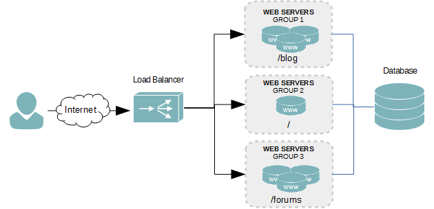

# Table of Contents
- [What is Load Balancer?](#WhatIsLoadBalancer)
- [Why you need Load Balancer?](#WhyYouNeedLoadbalancer)
- [How many type Load Balancer?](#HowManyTypeLoadbalancer)
- [Dissect load balancer?](#DissectLoadBalancer)
    - [L7 LoadBalancer](#L7LoadBalancer)
      - [Define](#Define)
      - [Life circle](#LifeCircle)
      - [How to good L7LB](#HowToGoodL7LB)
      - [Market Review](#MarketReview)
      - [Source code loadbalancer](#SourceCodeLoadbalancer])
      - [L7 Local to local](#L7LocalToLocal)
          - [Load test local to local](#LoadTestLocalToLocal)
            - [Context L7LB local](#ContextL7LBLocal)
            - [Process request](#ProccessRequest)
            - [Result](#ResultL7Local)
          - [Load test product](#LoadTestProduct)
            - [What is problem?](#WhatIsProblem)
            - [What is solution?](#WhatIsSolution)
            - [Result in product L7LB?](#ResultInProductL7LB)
              - [Haproxy L7LB result?](#HaproxyL7LBResult)
                  - [100K rqs with EC2_C5_4X_larger](#100KRqsWithEC2_C5_4X_larger)
                  - [todo optimal](#temp)
                  - [2M connect TCP HAPROXY](#2M connect TCP HAPROXY)
                
## What is Load Balancer? 
  It's a system navigating and split load. Ex: You have a billion rqs, you want 50% request to North American's region, 30% request to Asian, 20 % request to Europe. This is job of load balance.

## Why you need Load Balancer?  
  One server don't have scale for everything. When request up, you need more server. At time, you need one system navigating and split load to this server. You need load balancer.

## How many type Load Balancer?  
  For Hardware, have 2 type: LoadBalance software and LoadBalance Hardware.  
  For layout internet, have many type:  
     1) L7 LoadBalance  
     2) L4 LoadBalance  
     3) L3 or L3 and L4 loadBalance  
     4) Dynamic routing loadBalance + smart traffic  

  =================> Maybe have many type LB, but in this doc, we dissect for 4 type before. Type 1, 2, 3, 4 is order by ascending form small project to big project. Stemming from a problem: there is no server that can expand forever for needs, LB still run on server, LB must also increase gradually according to types 1, 2, 3, 4. We will explain it in specify type.

## Dissect load balancer? 
## L7 LoadBalancer 
## Define 

Simple define: L7LB is load balancer work on layer 7: Http, Ftp, Irc, Ssh, Dns,... It's directly interacting with the application backend system.

## Life circle 
In L7LB, endpoint request project to L7LB, L7 keep TCP connect and L7 call to backend app and forward response form backend app to endpoint.   
============================== endpoint ---->  L7LB  ----> backend app ===========================

## How to good L7LB 
From this define, these param importance for good L7LB:
1) Number concurrency rqs is good
2) Ram and cpu when up request to limit LB is small and has a stable operating threshold.
3) Against memory leak, cpu leak ==> stability of LB when run long time
4) Low latency

## Market Review  
LBL7 common:  HAProxy, Nginx, Traefik, ApacheLB and L7LB of cloud(aws has application LB)
We find many result benchmark L7LB. We summarize some conclusions. Don't have LB the best, every LB has strong point difference. But we choose LB suitable.  
1) L7LB of big cloud aws, google cloud is good. It's simple for implement if you use this cloud. It's way fast and good if you choose cloud.
2) For number concurrency request, HAProxy and Nginx have good point.
3) For memory, HAProxy and Nginx is not good, Apache-prework, Apache-wroker is good
4) For memory/concurrency, it's same 3.  
In one context, you have good choose. But, you remember important parameter for compare opensource LB, it's  1,2,3,4  for in "How to good L7LB".  
Opensource up and down continuous, you don't change it, you need understand L7LB work and remember param for compare and good select.  

## Source code load balancer 
Base code from link: https://github.com/gaplo917/load-balancer-benchmark  
I have many problem then i needs custom for this form this base code. Link source is : https://github.com/Nghiait123456/InfraForBigProject/tree/master/1_LoadBalancing/L7Loadbalancer/LoadBalancerBenchmark  

## L7 local to local  
## Load test local to local  
## Context L7LB local 
Same to author, you create 3 nodejs instance for backend load test, you create other tool L7LB : apache-event, apache-prework, apache-worker, haproxy, nginx, traefik in same docker-compose. All instance run in same docker-network.
## Process request 
 ================================  tool loadtest ==> L7LB  => nodejs backend =================================

## Result 
1) In context local ==> local, we get result /L7Loadbalancer/LoadBalancerBenchmark/result easy with cpu i5 8 core 8GB ram
2) You are very fast have quick test in local, but in product, it's not simple.  

## Load test product 
## What is problem? 
1) 4 tuple TCP: TCP uses 4-tuple (source IP, source port, destination IP, destination port)
   1 tcp connect define form 4 parameter source IP + source port + destination IP + destination port,combined 4 parameter is unique. It's required for defined one connect
2) ulimit in Linux: in Linux, everything is file, ulimit is parameter define maximum number of files open in one time
3) design LB : endpoint ==> LB  ==> backend, test high performance, i need many backend.

## What is solution?  

Solution and ideal from 3 theory :
1) From theory 1, i use one Ip for load test, but if it goes to limited, i will use multi ip load test
2) From theory 2, i set up ulimit to maximum in linux.
3) From theory 3, in load test, we have data not simple is {"ok"} and response from backend very fast. But in rqs high, you pay a lot of money and pay many times for implements it. I have simple solution, i use big project for load test. EX: gooogle.com:80 ==> return 404, and response 60 character in 100 ms, it's perfect for load test.  
I call google.com (backend) from aws (L7LB), it's very good and keep status response is 404.

## Result in product L7LB  
## Haproxy L7LB result? 
## 100K rqs with EC2_C5_4X_larger 
Context test in product  
1) For LB: we build one instance LoadBalancerBenchmark/docker-compose-haproxy-local-to-gg.yml in this.  
2) For Load Test, we build  one instance EC2_C5_4X_larger, build docker and use bombardier for load test. It's same : docker run -ti --rm --ulimit nofile=65535:65535 --network=host alpine/bombardier --http1 -c 400   -d 600s -t 1s  -l http://ec2-13-250-40-69.ap-southeast-1.compute.amazonaws.com:8080/  
Result:   
1) We test with rqs from 1000 to 100.000 rqs, time test form 10 s to 10 min,  total request from 10 000 to 65080275, cpu <= 60 %, ram is very good   
2) When we stop test, cpu is very fast to ~ 0 or 1 %, ram is very fast free => don't have leak ram, leak cpu   
3) Detail result in link /L7Loadbalancer/LoadBalancerBenchmark/result/HaproxyProduct/c5_4x_large.md   
=>>>>>>>>>>>>>>>>>>>>  Haproxy is very good for rqs, with one instance EC2_C5_4X_larger, we pass and run stable 100.000 rqs, we run stable in longtime, we have 100 M request continuous in 10 to 15 min and cpu and ram is good.   

